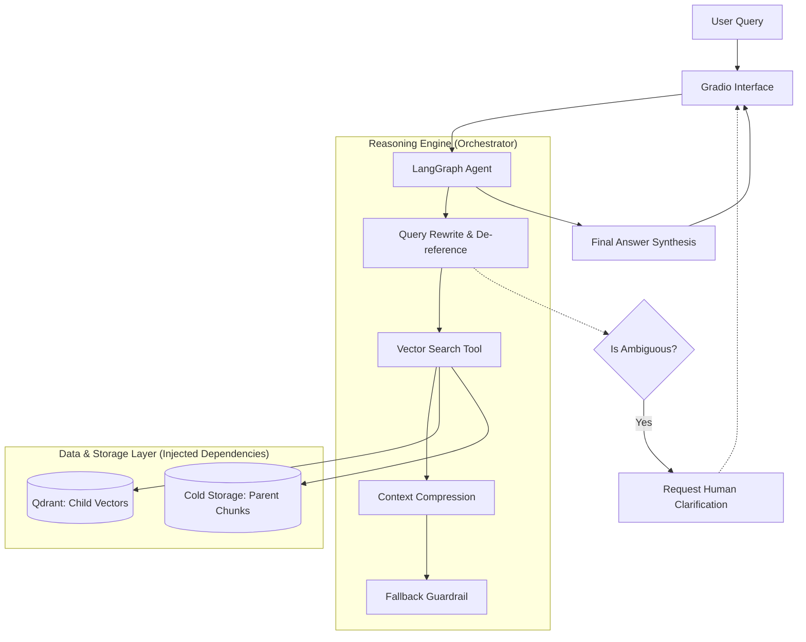

# Agentic RAG Assistant

[](https://www.python.org/)
[](https://github.com/langchain-ai/langgraph)
[](https://qdrant.tech/)
[](https://opensource.org/licenses/MIT)

A professional-grade **Agentic Retrieval-Augmented Generation (RAG)** system built with LangGraph. This project implements a modular, self-correcting research pipeline designed for high-precision document intelligence.

## Table of Contents
- [Overview](#overview)
- [System Architecture](#system-architecture)
- [Key Features](#key-features)
- [Installation & Setup](#installation--setup)
- [Usage](#usage)
- [Configuration](#configuration)
- [Testing](#testing)
- [Contributing](#contributing)
- [License](#license)

## Overview

Traditional RAG systems often suffer from the "context vs. precision" trade-off and fail gracefully when queries are ambiguous. This project addresses these limitations by introducing an **Agentic Loop** with sophisticated state management, recursive research capabilities, and human-in-the-loop guardrails.

## System Architecture

Designed for robustness and scalability, the architecture adheres to SOLID principles, utilizing Dependency Injection and explicit interface abstraction.



### 1. Hierarchical Indexing Strategy
To solve the "context vs. precision" trade-off, we employ a **Parent-Child Retrieval** pattern:
- **Child Vectorization**: Small, semantically dense chunks (e.g., 500 tokens) are used for high-precision vector search.
- **Parent Context**: Upon discovery, the system retrieves the full structural parent block (e.g., 2000-4000 tokens) to provide the LLM with complete thematic context, significantly reducing hallucinations.

### 2. Intelligent Reasoning Graph
The agent workflow is organized as a state-aware graph:
- **Query De-referencing & Expansion**: Analyzes conversation history to resolve pronouns and break complex queries into atomic, parallel research tasks.
- **Context Compression (Memory Management)**: Automatically summarizes intermediate tool results into a compact "Research Memory" when token thresholds are reached, allowing for deep, recursive research cycles without context overflow.
- **Human-in-the-Loop Integrated**: Detects ambiguous queries and pauses for user clarification before burning compute resources.
- **Self-Correction & Fallbacks**: Monitors its own progress; if time or token budgets are exceeded, it triggers a "Best Effort" synthesis of available data rather than failing.

## Key Features

- **Multi-Cloud/Local LLM Support**: Native adapters for **Ollama**, **OpenAI**, **Anthropic**, and **Google Gemini**.
- **Hybrid Search**: Combines Dense embeddings (Semantic) and Sparse embeddings (BM25) via Qdrant for superior retrieval performance.
- **Enterprise Design Patterns**: Employs Dependency Injection, Abstract Base Classes, and Custom Exception hierarchies for robust error handling.
- **Advanced UI**: Includes a polished Gradio interface for real-time document indexing and multi-agent chat.
- **Production-Ready Core**: Centered around centralized logging (Loguru), type safety (Pydantic), and environment-driven configuration.

## Installation & Setup

### 1. Prerequisites
- **Python:** 3.10 or higher.
- **Vector Database:** Qdrant (Runs locally by default via `qdrant-client`).
- **LLM Engine:** [Ollama](https://ollama.com/) (Required if running the default local LLM configuration).

### 2. Quick Start

Clone the repository and enter the directory:
```bash
git clone https://github.com/your-username/agentic-rag-assistant.git
cd agentic-rag-assistant
```

Install the package in development mode:
```bash
pip install -e .
```

Configure your environment variables:
```bash
cp .env.example .env
# Edit .env and supply your API keys or configure your local LLM settings.
```

## Usage

Launch the Gradio user interface:
```bash
python src/agentic_rag/app.py
```
This will start a local server (typically at `http://127.0.0.1:7860`). Open this URL in your browser to access the Document Management and Chat interfaces.

## Configuration

System behavior is managed through the `.env` file or direct environment variables. Key parameters include:

| Variable | Description | Default |
|----------|-------------|---------|
| `ACTIVE_LLM_CONFIG` | LLM Provider (`ollama`, `openai`, `anthropic`, `google`) | `ollama` |
| `LLM_MODEL` | Target Model ID | `qwen3:4b-instruct-2507-q4_K_M` |
| `MAX_TOOL_CALLS` | Safety cap for recursive research loops | `8` |
| `BASE_TOKEN_THRESHOLD` | Token limit before semantic context compression | `2000` |

## Testing

The project includes a comprehensive suite of unit tests to ensure architectural stability.

```bash
# Install test dependencies
pip install -e ".[test]"

# Run all tests
pytest tests/
```

## Contributing

Contributions are welcome! Please follow these steps:
1. Fork the repository.
2. Create your feature branch (`git checkout -b feature/AmazingFeature`).
3. Ensure all tests pass (`pytest tests/`).
4. Commit your changes (`git commit -m 'Add some AmazingFeature'`).
5. Push to the branch (`git push origin feature/AmazingFeature`).
6. Open a Pull Request.

*Note: Please ensure new code adheres to the project's dependency injection patterns and uses the custom exception hierarchy.*

## License

Distributed under the MIT License. See `LICENSE` for more information.

---
