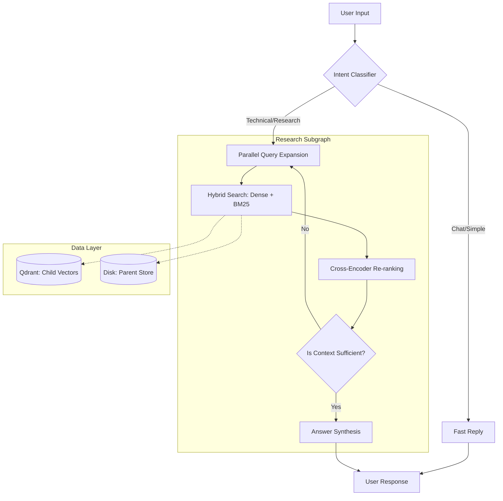

# 🧠 Agentic RAG Assistant: Enterprise-Grade Document Intelligence

[](https://www.python.org/)
[](https://github.com/langchain-ai/langgraph)
[](https://qdrant.tech/)
[](tests/)
[](docker-compose.yml)
[](https://opensource.org/licenses/MIT)

A state-of-the-art **Agentic Retrieval-Augmented Generation (RAG)** system built with **LangGraph**. This project implements a self-correcting, multi-agent research pipeline designed for high-precision document intelligence at scale.

---

## 🚀 Key Innovations

### 1. SOTA Retrieval Architecture
Standard RAG fails on technical nuances. We solve this with a multi-stage pipeline:
- **Hybrid Dense-Sparse Search**: Combines the semantic "vibe" of Dense embeddings with the surgical keyword precision of BM25.
- **Cross-Encoder Re-ranking**: Every retrieved chunk is validated by a secondary "Judge" model (`ms-marco-MiniLM`), virtually eliminating hallucinations.
- **Parent-Child Indexing**: Searches small chunks for precision, but feeds the LLM full thematic context (Parent blocks) for understanding.

### 2. Autonomous Agent Logic (LangGraph)
The system isn't just a list of steps; it's a **living graph** that:
- **Fast-Path Routing**: Instantly recognizes conversational filler (e.g., "Hi") and bypasses the expensive research loop.
- **Recursive Decomposition**: Breaks complex user questions into atomic sub-tasks handled in parallel.
- **Self-Correction**: Automatically detects if it lacks info and triggers recursive searches until the threshold is met.

---

## 🏗️ System Architecture

### Agentic Decision Flow
The following diagram visualizes the agent's reasoning process, including the "Fast-Path" bypass and the "Research Loop":



---

## 🛠️ Installation & Setup

### Option A: The "Instant" Way (Docker)
Ensure you have Docker and Docker Compose installed.
```bash
# 1. Clone & Enter
git clone https://github.com/your-username/agentic-rag-assistant.git
cd agentic-rag-assistant

# 2. Configure (supply your API keys)
cp .env.example .env

# 3. Launch everything (App + Qdrant)
docker-compose up --build
```
*App will be live at `http://localhost:7860`.*

### Option B: The Developer Way (Local)
```bash
# 1. Install dependencies
pip install -e "."

# 2. Setup Qdrant & Ollama
# Ensure Qdrant is running (default: http://localhost:6333)
# Ensure Ollama is running (default: http://localhost:11434)

# 3. Running Tests & Linting
pip install -e ".[test]"
pytest tests/
mypy src/agentic_rag
```

---

## ⚙️ Configuration Matrix

The system is fully controlled via `.env`. Key production settings:

| Variable | Strategy | Default |
|----------|----------|---------|
| `ACTIVE_LLM_CONFIG` | Switch Provider (`ollama`, `openai`, `anthropic`, `google`) | `ollama` |
| `MAX_TOOL_CALLS` | Cap on recursive research depth | `8` |
| `BASE_TOKEN_THRESHOLD` | When to trigger semantic context compression | `2000` |
| `QDRANT_URL` | Remote DB connection (Cloud/Docker) | `None` (Local) |

---

## 🛡️ Enterprise Design Principles
- **SOLID Execution**: Decoupled infrastructure via `AbstractVectorDB` and `AbstractParentStore` interfaces.
- **Type Safety**: 100% Mypy strict compliance.
- **Modular Data Engineering**: Isolated indexing logic specialized for Markdown/PDF structure.
- **Observability**: Real-time reasoning streaming via LangGraph intermediate events.

---

## 📄 License
Distributed under the MIT License. See `LICENSE` for more information.
